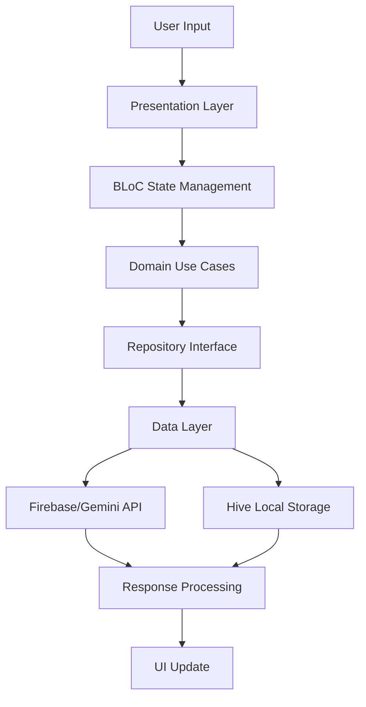
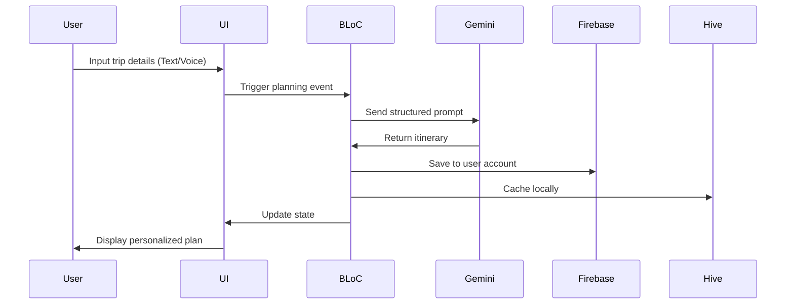

# 🌟 Smart Trip Planner

<div align="center">
  
  
  
  
  
  
  
  
  
</div>
<div align="center">
  <h3>An intelligent, LLM-powered travel companion built with Flutter</h3>
  <p>Generate personalized trip itineraries with Google Gemini AI, featuring real-time connectivity, offline support, and seamless state management.</p>
</div>
<div align="center">
  <h3>An intelligent, LLM-powered travel companion built with Flutter</h3>
  <p>Generate personalized trip itineraries with Google Gemini AI, featuring real-time connectivity, offline support, and seamless state management.</p>
</div>

---

## 📋 Table of Contents

- [Features](#-features)
- [Tech Stack](#-tech-stack)
- [Architecture](#-architecture)
- [Screenshots](#-screenshots)
- [Getting Started](#-getting-started)
- [Project Structure](#-project-structure)
- [LLM Integration](#-llm-integration)
- [Cost Analysis](#-cost-analysis)
- [Contributing](#-contributing)
- [License](#-license)

## ✨ Features

### 🎯 Core Features
- **AI-Powered Trip Planning**: Generate personalized itineraries using Google Gemini
- **Clean Architecture**: Well-structured, maintainable codebase
- **Firebase Integration**: Authentication and cloud storage
- **Offline Support**: Local caching with Hive database
- **Real-time Connectivity**: Internet status monitoring and retry mechanisms
- **Speech Input**: Voice-to-text for natural trip planning
- **Responsive UI**: Material 3 design with intuitive user experience

### 🔧 Technical Features
- **State Management**: BLoC pattern for predictable state handling
- **Dependency Injection**: GetIt for clean dependency management
- **Error Handling**: Comprehensive error handling and user feedback
- **Multi-platform**: Android and iOS support
- **Secure Storage**: Firebase Auth with local data caching

## 🛠️ Tech Stack

| Category | Technology |
|----------|------------|
| **Frontend** | Flutter 3.13+ |
| **State Management** | BLoC Pattern |
| **AI Integration** | Google Gemini via `google_generative_ai` |
| **Authentication** | Firebase Auth |
| **Cloud Database** | Cloud Firestore |
| **Local Storage** | Hive Database |
| **Dependency Injection** | GetIt |
| **UI Framework** | Material 3 |
| **Networking** | Connectivity Plus |
| **Speech Recognition** | Speech-to-Text |

## 🏗️ Architecture

This application follows **Clean Architecture** principles with clear separation of concerns:

```
├── presentation/          # UI Layer
│   ├── pages/            # Screen widgets
│   ├── widgets/          # Reusable UI components
│   └── blocs/            # BLoC state management
├── domain/               # Business Logic Layer
│   ├── entities/         # Core business objects
│   ├── repositories/     # Abstract repository interfaces
│   └── usecases/         # Business use cases
└── data/                 # Data Layer
    ├── datasources/      # Remote & local data sources
    ├── repositories/     # Repository implementations
    └── models/           # Data transfer objects
```

### 🔄 Data Flow



## 📱 Screenshots

<table>
  <tr>
    <td align="center">
      
      <br/>
      <sub><b>Authentication</b></sub>
    </td>
    <td align="center">
      
      <br/>
      <sub><b>Home Dashboard</b></sub>
    </td>
    <td align="center">
      
      <br/>
      <sub><b>Trip Input Interface</b></sub>
    </td>
  </tr>
  <tr>
    <td align="center">
      
      <br/>
      <sub><b>Generated Itinerary</b></sub>
    </td>
    <td align="center">
      
      <br/>
      <sub><b>Follow ups</b></sub>
    </td>
    <td align="center">
      
      <br/>
      <sub><b>No internet</b></sub>
    </td>
  </tr>
</table>

## 🚀 Getting Started

### Prerequisites

Before running this project, ensure you have:

- **Flutter SDK** (3.13 or higher)
- **Dart SDK** (3.1 or higher)
- **Firebase CLI**
- **FlutterFire CLI**
- **Android Studio** or **Xcode**
- **Node.js** and **npm**

### Installation

1. **Clone the repository**
   ```bash
   git clone https://github.com/your-username/smart_trip_planner_flutter.git
   cd smart_trip_planner_flutter
   ```

2. **Install dependencies**
   ```bash
   flutter pub get
   ```

3. **Firebase Setup**
   ```bash
   firebase login
   firebase init
   flutterfire configure
   ```

4. **Add Firebase configuration files**
   - Add `google-services.json` to `android/app/`
   - Add `GoogleService-Info.plist` to `ios/Runner/`

5. **Configure Gemini API**
   ```dart
   // Add your Gemini API key to lib/core/constants/api_constants.dart
   const String geminiApiKey = 'your-gemini-api-key';
   ```

6. **Run the application**
   ```bash
   flutter run
   ```

## 📁 Project Structure

```
lib/
├── core/
│   ├── constants/
│   ├── error/
│   ├── network/
│   └── utils/
├── data/
│   ├── datasources/
│   ├── models/
│   └── repositories/
├── domain/
│   ├── entities/
│   ├── repositories/
│   └── usecases/
├── presentation/
│   ├── blocs/
│   ├── pages/
│   └── widgets/
└── main.dart
```

## 🤖 LLM Integration

### Gemini AI Workflow

The application uses Google Gemini for intelligent trip planning:



### Prompt Engineering

The app uses structured prompts for optimal results:

```
Generate a detailed {duration} trip itinerary for {destination} in {month} for {people_count} people with a {budget} budget, focusing on {preferences}.

Include:
- Daily schedules with timings
- Accommodation suggestions
- Restaurant recommendations
- Transportation options
- Estimated costs
- Local tips and cultural insights
```

## 💰 Cost Analysis

| Prompt Type | Token Count | Estimated Cost | Use Case |
|-------------|-------------|----------------|----------|
| Short prompt (12-20 words) | ~200 | $0.001 | Quick suggestions |
| Detailed prompt (40-60 words) | ~800 | $0.004 | Standard planning |
| Comprehensive prompt (80+ words) | ~1,500 | $0.007 | Detailed itineraries |

*Based on Gemini 1.5 Flash pricing (as of 2024)*

## 🧪 Testing

Run the test suite:

```bash
# Unit tests
flutter test

# Integration tests
flutter test integration_test/

# Widget tests
flutter test test/widget_test/
```

## 🚀 Deployment

### Android
```bash
flutter build apk --release
```

### iOS
```bash
flutter build ios --release
```

## 📊 Performance Metrics

- **App Size**: ~15MB (release build)
- **Cold Start Time**: <2 seconds
- **Memory Usage**: ~50MB average
- **Battery Impact**: Minimal (optimized for efficiency)

## 🤝 Contributing

We welcome contributions! Please follow these steps:

1. **Fork the repository**
2. **Create a feature branch**
   ```bash
   git checkout -b feature/amazing-feature
   ```
3. **Commit your changes**
   ```bash
   git commit -m 'Add amazing feature'
   ```
4. **Push to the branch**
   ```bash
   git push origin feature/amazing-feature
   ```
5. **Open a Pull Request**

### Development Guidelines

- Follow [Flutter style guide](https://docs.flutter.dev/development/tools/formatting)
- Write meaningful commit messages
- Include tests for new features
- Update documentation as needed

## 📄 License

This project is licensed under the MIT License - see the [LICENSE](LICENSE) file for details.

## 👥 Team

- **Developer**: [Aditya Magar](https://github.com/Aditya290605)
- **Design**: [Planet Ai team](https://www.figma.com/design/IClSVtJwa8h9xcHX7fFvJs/Mobile-Engineer-Assignment--Internship-2025-?node-id=0-1&p=f&t=ctbMXMZCZD2SqDTg-0)

## 🙏 Acknowledgments

- Google Gemini team for the powerful AI API
- Flutter team for the amazing framework
- Firebase team for seamless backend services
- Open source community for invaluable packages

---

<div align="center">
  <p>Built with ❤️ and lots of ☕</p>
  <p>If you found this project helpful, please consider giving it a ⭐</p>
</div>

## 🔗 Links

- [Demo Video](https://drive.google.com/file/d/1YItYmiutPvxOu-X87uroMtno845TLOSk/view?usp=sharing)
- [Summary report](https://drive.google.com/file/d/19i-v-FicbmSTgmGkf6PfPL-YRBREvYGV/view?usp=sharing)


---

*For support, please open an issue or contact [magaraditya2911@gmail.com]*
